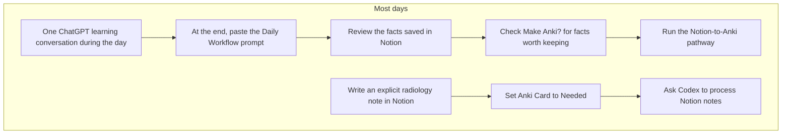
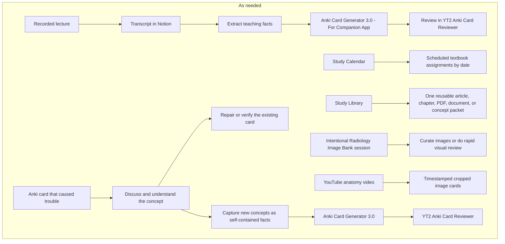

# Radiology study — start here

This is the plain-language menu for choosing a study route. Start a new Codex conversation and say:

```text
$radiology-study
```

You can also name the route in the same message. The two routes under **Most days** are the routine ones. Everything else is available when the source or situation calls for it.

## Most days



### 1. Daily learning conversation

Use one continuing ChatGPT conversation as you learn throughout the day. Ask questions, correct misunderstandings, and work toward the final explanation there.

At the end of the day:

1. Open [Radiology Learning System — Daily Workflow](https://app.notion.com/p/3c51d706353981e2b85cf69b25683db5).
2. Copy its **End-of-day prompt** into that day's learning conversation.
3. The conversation creates individual facts in **Radiology Conversation Card Sources** and a dated Notion review page.
4. Edit the facts if needed and check **Make Anki?** only for facts you want converted.
5. The dated review page is marked **Anki Card = Needed**, so it is included in the normal Notion-to-Anki run. In any local Codex conversation, say:

```text
$radiology-cards Run my Notion-to-Anki pathway once.
```

The page-level **Needed** flag admits the daily page; the **Make Anki?** checks inside it choose the facts. Card wording and clozes happen only after selection. If you want to process the selected fact queue immediately without running the rest of the eligible Notion cohort, you can instead say:

```text
$radiology-cards Convert my selected daily conversation facts.
```

### 2. Explicit Notion notes marked Needed

Use this when you deliberately write or save a particular radiology note and already know it should become a card.

1. Save the note in **Radiology Notes**.
2. Set **Anki Card** to **Needed**.
3. In any local Codex conversation, say:

```text
$radiology-cards Run my Notion-to-Anki pathway once.
```

By default, this processes the current Chicago date and the preceding six dates, plus previously admitted unresolved items. Name a page, date range, or older backlog when you want a different scope.

Both daily routes enter the same Notion-to-Anki run when their Radiology Notes pages are marked **Needed**. Daily Learning pages use their inner **Make Anki?** selections; ordinary notes use the note content itself.

## As needed



### Recorded lecture

Use this for a lecture you recorded.

`recording → manual upload to the transcription service → AI transcript in Notion → self-contained teaching facts → Anki Card Generator 3.0 - For Companion App project → JSON → YT2 Anki Card Reviewer → edit/save/discard → APKG → Anki import`

The exact ChatGPT project is **Anki Card Generator 3.0 - For Companion App**. It is the card-writing instruction source for this route. The **YT2 Anki Card Reviewer** is the visual editor and exporter.

### Study Calendar

Use this when you want to follow a date-based textbook plan or a planned assignment. Open [StudyOS — Study Calendar](https://radiology-study-os.glut4.chatgpt.site). Its main tabs are **Today, Visuals, Audio, Quizzes, Saved, Cards,** and **More**.

Quick description: **scheduled textbook study by date**.

A full one-time build can be requested with:

```text
$radiology-cards Run the full nightly packet once.
```

The full packet needs a real next assignment. A one-time request leaves the recurring automation paused.

### Study Library

Use this for one article, chapter, PDF, document, or concept that you want to keep as a reusable packet. Open [StudyOS — Study Library](https://radiology-study-os.glut4.chatgpt.site/library).

Quick description: **one source turned into a reusable reading, visual, audio, and quiz packet**.

Attach or identify the source in a local Codex conversation and say:

```text
Create a Study Library packet from this source.
```

The packet can contain the source record, visual feed, detailed audio narration, quick quiz, and full quiz. Creating the packet does not automatically create Anki cards. Highlights, saved questions, and saved visual panels enter the shared saved-item queue. To process those, say:

```text
$radiology-cards Process my StudyOS saved items.
```

### YouTube anatomy image cards

Use this when a YouTube anatomy or radiology video shows labeled structures that can become image-identification or localization cards.

Quick description: **extract the right video frames, crop the anatomy panel, and make image cards**.

In a new local Codex conversation, provide the video URL and transcript or the structures you want, then say:

```text
$radiology-study Use my YouTube anatomy image-card workflow for this video.
```

The detailed route is in `YOUTUBE_ANATOMY_ANKI_WORKFLOW.md`. The prior wrist and elbow builds remain examples, not the only conversation from which the route can be used.

### Radiology Image Bank — Rapid Visual Review

Use this when you deliberately want to build or review a large visual library of diagnoses. This is separate from StudyOS: its main purpose is repeated image exposure, recognition across varied appearances and modalities, comparison with mimics, and concise report wording.

Quick description: **curate several images for each diagnosis, publish them, and swipe through them for rapid visual practice**.

The current working implementation is the **MSK Image Bank** desktop app. It supports fast paste/drag capture into XR, CT, and MRI panels, multiple images per diagnosis, editable findings, favorites, fullscreen inspection, and one-button publication to its phone review page.

To open the route from a new conversation, say:

```text
$radiology-study Open my Radiology Image Bank route.
```

The current phone reviewer is [MSK Image Bank Mobile Review](https://starfox1230.github.io/The-Library/apps/temporary-apps/library/2026-09-02-msk-image-bank/mobile/). It currently reviews one selected pathology at a time. Randomized or continuous cross-pathology scrolling, Core Radiology expansion, explicit completion status, and per-image Anki flags are planned rather than current features.

The exact launch commands, storage locations, verified counts, curation loop, review loop, and future boundary are in `RADIOLOGY_IMAGE_BANK_WORKFLOW.md`.

### Review Later

Use this when an existing Anki card is confusing, ambiguous, missing context, or testing the wrong thing.

Quick description: **understand the failed card, then handle the original card and any new concepts separately**.

Review Later can produce two results, and a session may produce either or both:

1. **Existing-card result:** keep, edit, split, replace, suspend, or research the original card. Apply and verify the actual Anki change when one is needed.
2. **New-concept result:** turn new concepts discovered during the explanation into simple, self-contained statements, then pass those statements through **Anki Card Generator 3.0 - For Companion App → JSON → YT2 Anki Card Reviewer → APKG → Anki**.

Use this saved prompt in the same conversation after the concept is clear:

```text
Turn this Review Later discussion into a list of the facts I clearly considered important. Write each fact as a simple, accurate, self-contained statement that does not rely on an antecedent, the original card, or the earlier conversation. Keep one main idea per statement. When a fact matters because it contrasts with another fact, write the related statements in parallel so the differences stand out. Include newly clarified concepts that deserve their own cards. Do not write cloze deletions or JSON yet.
```

The detailed steps and short reusable commands are in `REVIEW_LATER_WORKFLOW.md` beside this menu. The original card is complete only when its disposition is recorded and any required Anki edit is verified. New cards are complete only after their import is verified.

### Card review queues

Use the **YT2 Anki Card Reviewer** for JSON produced by **Anki Card Generator 3.0 - For Companion App** or other manual sources. Use the **StudyOS Cards** tab for candidates produced by the central Notion/StudyOS route. Saving a candidate means it is approved in that reviewer; it does not by itself prove export or Anki import.

## Skills you need to remember

| Skill | What it does |
|---|---|
| `$radiology-study` | Shows this menu and starts the route you choose |
| `$radiology-cards` | Executes the central card routes after you identify the source |

In the ChatGPT desktop app, open **Skills** in the sidebar to browse installed skills. In Codex CLI or the IDE extension, use `/skills` or type `$` to choose one. Codex can also select a skill automatically when your request clearly matches its description. See the official [OpenAI Skills documentation](https://developers.openai.com/codex/skills).

If a newly created skill does not appear, restart Codex. The relevant personal skill folders on this computer are:

- `C:\Users\sterl\.codex\skills\radiology-study`
- `C:\Users\sterl\.codex\skills\radiology-cards`

## Where the parts live

| Location | What belongs there |
|---|---|
| This file | The simple route menu and exact starting prompts |
| `RUN_RADIOLOGY_CARDS.md` | How Codex executes the central card workflows |
| `CARD_STYLE_GUIDE.md` | What makes a good card |
| `RADIOLOGY_CONVERSATION_ANKI_WORKFLOW.md` | Selected daily-conversation facts |
| `YOUTUBE_ANATOMY_ANKI_WORKFLOW.md` | Timestamped anatomy image-card route |
| `RADIOLOGY_IMAGE_BANK_WORKFLOW.md` | Deliberate image curation and rapid visual-recognition review |
| `REVIEW_LATER_WORKFLOW.md` | Existing-card repair and new-concept card creation after Review Later |
| Notion | Transcripts, daily facts, explicit notes, and human review state |
| StudyOS | Study Calendar, Study Library, saved items, and the central card reviewer |
| YT2 Anki Card Reviewer | Manual JSON card review and export |
| Anki | Imported cards and actual retrieval practice |

The dated workflow assessments in `C:\Users\sterl\Documents\Radiology Studying\reports` explain how this conclusion was reached. They are reference material. This file is the place to begin.

Detailed current map and evidence: [Radiology study workflow map](https://app.notion.com/p/3d31d706353981b6a68fe89a48db0cb2).
